# Awesome Mojo🔥


Mojo 🔥 — a new programming language for all developers, AI/ML scientists and software engineers.

A curated list of awesome Mojo🔥 code, problem-solving, solution, and in future libraries, frameworks, software and
resources.

Let's accumulate here very new technology knowledge and best practices.

* [Awesome Mojo🔥](https://github.com/ego/awesome-mojo)
* [Mojo 🔥Driven Community](https://mojo-lang.dev)
* [Official Mojo docs](https://docs.modular.com/mojo/)

Mojo is a programming language that combines the user-friendliness of Python with the performance capabilities of C++
and Rust. Additionally, Mojo enables users to harness the vast ecosystem of Python libraries.

In a brief

* Mojo allows you to leverage the entire Python ecosystem.
* Mojo is designed to become a superset of Python.
* Make Mojo compatible with existing Python programs.
* Mojo as a member of the Python family.
* Applied for AI systems and AI field.
* Scalable programming for heterogeneous systems.
* Building unify the world’s ML/AI infrastructure.
* Innovations in compiler internals.
* Support for current and emerging hardware accelerators.
* Systems programming features.
* Leverage the existing MLIR compiler ecosystem.

# Hello Mojo🔥

Mojo is a new programming language that bridges the gap between research and production by combining the best of Python
syntax with systems programming and metaprogramming.

`hello.mojo` or `hello.🔥` the file extension can be an emoji!

* [Hello Mojo 🔥](algorithm/HelloMojo.🔥)

You can read more about why Modular doing this [Why Mojo🔥](https://docs.modular.com/mojo/why-mojo.html)

> What we wanted was an innovative and scalable programming model that could target accelerators and other heterogeneous
> systems that are pervasive in the AI field.
> ...
> Applied AI systems need to address all these issues, and we decided there was no reason it couldn’t be done with just
> one language. Thus, Mojo was born.

But Python has done its job very well =)

> We didn’t see any need to innovate in language syntax or community.
> So we chose to embrace the Python ecosystem because it is so widely used, it is loved by the AI ecosystem, and because
> we believe it is a really nice language.

## Why is it called Mojo?

> Mojo🔥 means “a magical charm” or “magical powers.”
> We thought this was a fitting name for a language that brings magical powers to Python :python:,
> including unlocking an innovative programming model for accelerators and other heterogeneous systems pervasive in AI today.

**Guido van Rossum** [benevolent dictator for life](https://en.wikipedia.org/wiki/Guido_van_Rossum) and **Christopher Arthur Lattner** [distinguished inventor, creator and well-known leader](https://en.wikipedia.org/wiki/Chris_Lattner) about Mojo🔥pronunciation =)


According to the description

* [Mojo word definition](https://duckduckgo.com/?q=mojo&ia=definition&iax=definition)
* [Mojo sound](mojo_American_English_pronunciation.mp3)


# Background and influenced by

Who knows that these programming languages will be very happy, because Mojo benefits from tremendous lessons learned from
other [languages](https://en.wikipedia.org/wiki/History_of_programming_languages) Rust, Swift, Julia, Zig, Nim, etc.

* Rust starts the C revolution and now [Rust in the Linux kernel](https://docs.kernel.org/rust/index.html).
* [Swift](https://www.swift.org) makes [Apple beautiful](https://developer.apple.com/swift/) from a technical
  perspective.
* [Julia](https://julialang.org) high performance.
* [Nim](https://nim-lang.org) systems programming language.
* [Zig](https://ziglang.org) general-purpose programming language. We are like and following it =)

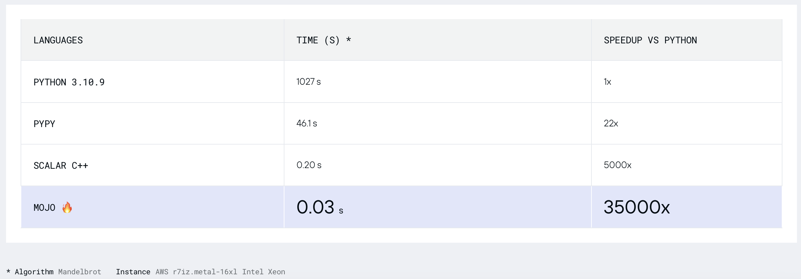

# News

[new]

* [Chris Lattner: Future of Programming and AI | Lex Fridman Podcast #381](https://www.youtube.com/watch?v=pdJQ8iVTwj8)
* [Mojo and Python type system explained | Chris Lattner and Lex Fridman](https://www.youtube.com/watch?v=0VCq8jJjAPc)
* [Can Mojo run Python code? | Chris Lattner and Lex Fridman](https://www.youtube.com/watch?v=99hRAvk3wIk)
* [Switching from Python to Mojo programming language | Chris Lattner and Lex Fridman](https://www.youtube.com/watch?v=7wo4vyB7l3s)
* New [GitHub Topic mojo-lang](https://github.com/topics/mojo-lang). So you can follow it.

  

* [Guido van Rossum about Mojo = Python with C++/GPU performance?](https://discuss.python.org/t/mojo-python-with-c-gpu-performance/26993/6)
  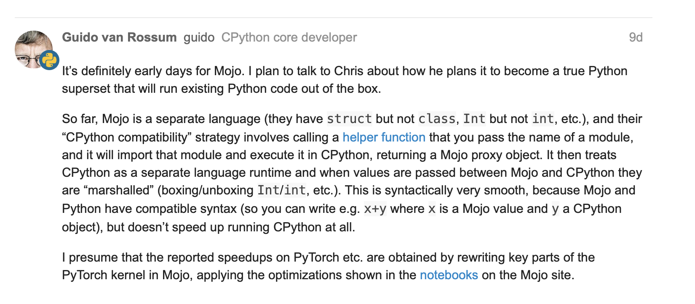
* [Tensor struct with some basic ops #251](https://github.com/modularml/mojo/discussions/251)
* [Matrix fn with numpy #267](https://github.com/modularml/mojo/discussions/267)
* Updates about `lambda` and `parameter` [Closures and higer order functions in mojo #244](https://github.com/modularml/mojo/discussions/244#discussioncomment-6008071)
* May-25-2023, Guido van Rossum (gvanrossum#8415), creator and emeritus BDFL of Python, visit the Mojo🔥 public [Discord Chat](https://www.discord.gg/modular)
* [Waiting for a Mojo🔥 syntax highlighting at GitHub](https://github.com/github-linguist/linguist/pull/6400)
* [New Mojo🔥release 2023-05-24](https://docs.modular.com/mojo/changelog.html#section)

[old]

Mojo🔥

* [Changelog](https://docs.modular.com/mojo/changelog.html)
* [Discussions](https://github.com/modularml/mojo/discussions?discussions_q=is%3Aopen)
* [Issues](https://github.com/modularml/mojo/issues)


# Awesome Mojo🔥 code

# Binary Search Algorithm

In computer science, [binary search algorithm](https://en.wikipedia.org/wiki/Binary_search_algorithm), also known as
half-interval search, logarithmic search, or binary chop, is a search algorithm that finds the position of a target
value within a sorted array.

Let's do some code with Python, Mojo🔥, Swift, V, Julia, Nim, Zig.

Note:
For **Python** and **Mojo** versions,
I leave some optimization and make the code similar for measurement and comparison.

## [Python Binary Search](algorithm/binary_search_Python.py)

```python
from typing import List
import timeit

SIZE = 1000000
MAX_ITERS = 100
COLLECTION = tuple(i for i in range(SIZE))  # Make it aka at compile-time.


def python_binary_search(element: int, array: List[int]) -> int:
    start = 0
    stop = len(array) - 1
    while start <= stop:
        index = (start + stop) // 2
        pivot = array[index]
        if pivot == element:
            return index
        elif pivot > element:
            stop = index - 1
        elif pivot < element:
            start = index + 1
    return -1


def test_python_binary_search():
    _ = python_binary_search(SIZE - 1, COLLECTION)


print(
    "Average execution time of func in sec",
    timeit.timeit(lambda: test_python_binary_search(), number=MAX_ITERS),
)
```

## [Mojo🔥 Binary Search](algorithm/BinarySearch_Mojo.mojo)

```python
"""Implements basic binary search."""

from Benchmark import Benchmark
from Vector import DynamicVector


alias SIZE = 1000000
alias NUM_WARMUP = 0
alias MAX_ITERS = 100


fn mojo_binary_search(element: Int, array: DynamicVector[Int]) -> Int:
    var start = 0
    var stop = len(array) - 1
    while start <= stop:
        let index = (start + stop) // 2
        let pivot = array[index]
        if pivot == element:
            return index
        elif pivot > element:
            stop = index - 1
        elif pivot < element:
            start = index + 1
    return -1


@parameter  # statement runs at compile-time.
fn get_collection() -> DynamicVector[Int]:
    var v = DynamicVector[Int](SIZE)
    for i in range(SIZE):
        v.push_back(i)
    return v


fn test_mojo_binary_search() -> F64:
    fn test_closure():
        _ = mojo_binary_search(SIZE - 1, get_collection())
    return F64(Benchmark(NUM_WARMUP, MAX_ITERS).run[test_closure]()) / 1e9


print(
    "Average execution time of func in sec ",
    test_mojo_binary_search(),
)
```

**It is the first binary search written in Mojo🔥by community (@ego) and posted in mojo-chat.**

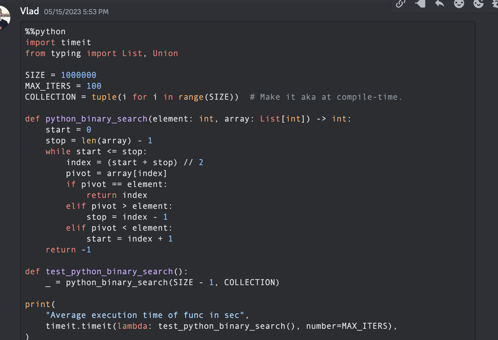
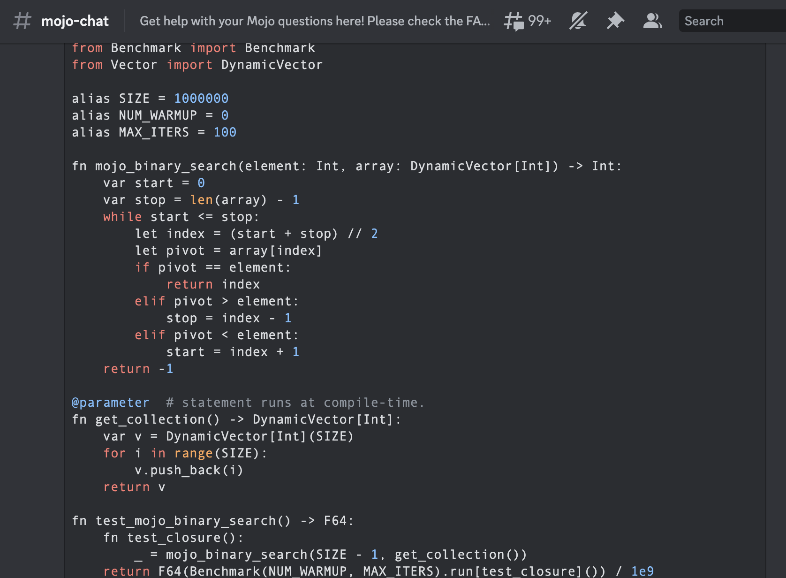

## [Swift Binary Search](algorithm/binarySearch_Swift.swift)

```swift
func binarySearch(items: [Int], elem: Int) -> Int {
    var low = 0
    var high = items.count - 1
    var mid = 0
    while low <= high {
        mid = Int((high + low) / 2)
        if items[mid] < elem {
            low = mid + 1
        } else if items[mid] > elem {
            high = mid - 1
        } else {
            return mid
        }
    }
    return -1
}

let items = [1, 2, 3, 4, 0].sorted()
let res = binarySearch(items: items, elem: 4)
print(res)
```

## [Julia Binary Search](algorithm/binarysearch_Julia.jl)

```julia
function binarysearch(lst::Vector{T}, val::T) where T
    low = 1
    high = length(lst)
    while low ≤ high
        mid = (low + high) ÷ 2
        if lst[mid] > val
            high = mid - 1
        elseif lst[mid] < val
            low = mid + 1
        else
            return mid
        end
    end
    return 0
end
```

## [Nim Binary Search](algorithm/binarySearch_Nim.nim)

```nim
proc binarySearch[T](a: openArray[T], key: T): int =
  var b = len(a)
  while result < b:
    var mid = (result + b) div 2
    if a[mid] < key: result = mid + 1
    else: b = mid
  if result >= len(a) or a[result] != key: result = -1


let res = @[2,3,4,5,6,7,8,9,10,12,14,16,18,20,22,25,27,30]
echo binarySearch(res, 10)
```

## [Zig Binary Search](algorithm/BinarySearch_Zig.zig)

```zig
const std = @import("std");

fn binarySearch(comptime T: type, arr: []const T, target: T) ?usize {
    var lo: usize = 0;
    var hi: usize = arr.len - 1;

    while (lo <= hi) {
        var mid: usize = (lo + hi) / 2;

        if (arr[mid] == target) {
            return mid;
        } else if (arr[mid] < target) {
            lo = mid + 1;
        } else {
            hi = mid - 1;
        }
    }

    return null;
}
```

## [V Binary Search](algorithm/binary_search_V.v)

```v
fn binary_search(a []int, value int) int {
    mut low := 0
    mut high := a.len - 1
    for low <= high {
        mid := (low + high) / 2
        if a[mid] > value {
            high = mid - 1
        } else if a[mid] < value {
            low = mid + 1
        } else {
            return mid
        }
    }
    return -1
}

fn main() {
    search_list := [1, 2, 3, 5, 6, 7, 8, 9, 10]
    println(binary_search(search_list, 9))
}
```

## [Bonus V Breadth First Search Path](algorithm/bfs_V.v)
    
* [BFS at vlang examples](https://github.com/vlang/v/blob/master/examples/graphs/bfs.v)
* [BFS original PR](https://github.com/ego/v/blob/e13474757bee0afa00e8c4dd013b14e2f4fbc428/examples/bfs.v)

```v
fn breadth_first_search_path(graph map[string][]string, vertex string, target string) []string {
    mut path := []string{}
    mut visited := []string{init: vertex}
    mut queue := [][][]string{}
    queue << [[vertex], path]
    for queue.len > 0 {
        mut idx := queue.len - 1
        node := queue[idx][0][0]
        path = queue[idx][1]
        queue.delete(idx)
        if node == target {
            path << node
            return path
        }
        for child in graph[node] {
            mut tmp := path.clone()
            if child !in visited {
                visited << child
                tmp << node
                queue << [[child], tmp]
            }
        }
    }
    return path
}

fn main() {
    graph := map{
        'A': ['B', 'C']
        'B': ['A', 'D', 'E']
        'C': ['A', 'F']
        'D': ['B']
        'E': ['B', 'F']
        'F': ['C', 'E']
    }
    println('Graph: $graph')
    path := breadth_first_search_path(graph, 'A', 'F')
    println('The shortest path from node A to node F is: $path')
    assert path == ['A', 'C', 'F']
}
```

# Fizz buzz

* [Leetcode Fizz buzz problem](https://leetcode.com/problems/fizz-buzz/)
* [Wikipedia Fizz buzz](https://en.wikipedia.org/wiki/Fizz_buzz)
* Add some optimisation, according to a Wikipedia problem statement.

## [Python Fizz buzz](algorithm/fizz_buzz_Python.py)

```python
import timeit

SIZE = 100
MAX_ITERS = 100


def _fizz_buzz():  # Make it aka at compile-time.
  res = []
  for n in range(1, SIZE+1):
    if (n % 3 == 0) and (n % 5 == 0):
      s = "FizzBuzz"
    elif n % 3 == 0:
      s = "Fizz"
    elif n % 5 == 0:
      s = "Buzz"
    else:
      s = str(n)
    res.append(s)
  return res


DATA = _fizz_buzz()


def fizz_buzz():
  print("\n".join(DATA))


print(
  "Average execution time of Python func in sec",
  timeit.timeit(lambda: fizz_buzz(), number=MAX_ITERS),
)

# Average execution time of Python func in sec 0.005334990004485007
```

## [Clojure Fizz buzz](algorithm/fizz_buzz_Clojure.clj)

```clojure
(import '[java.io OutputStream])
(require '[clojure.java.io :as io])

(def devnull (io/writer (OutputStream/nullOutputStream)))

(defmacro timeit [n expr]
  `(with-out-str (time
                   (dotimes [_# ~(Math/pow 1 n)]
                     (binding [*out* devnull]
                       ~expr)))))

(defmacro macro-fizz-buzz [n]
  `(fn []
    (print
      ~(apply str
        (for [i (range 1 (inc n))]
          (cond
            (zero? (mod i 15)) "FizzBuzz\n"
            (zero? (mod i 5))  "Buzz\n"
            (zero? (mod i 3))  "Fizz\n"
            :else              (str i "\n")))))))

(print (timeit 100 (macro-fizz-buzz 100)))

;; "Elapsed time: 0.175486 msecs"
;; Average execution time of Clojure func in sec 0.000175486 seconds
```

## [Mojo🔥Fizz buzz](algorithm/fizz_buzz_Mojo.mojo)

```python
from String import String
from Benchmark import Benchmark

alias SIZE = 100
alias NUM_WARMUP = 0
alias MAX_ITERS = 100


@parameter  # statement runs at compile-time.
fn _fizz_buzz() -> String:
    var res: String = ""
    for n in range(1, SIZE+1):
      if (n % 3 == 0) and (n % 5 == 0):
        res += "FizzBuzz"
      elif n % 3 == 0:
        res += "Fizz"
      elif n % 5 == 0:
        res += "Buzz"
      else:
        res += String(n)
      res += "\n"
    return res


fn fizz_buzz():
    print(_fizz_buzz())

fn run_benchmark() -> F64:
    fn _closure():
        _ = fizz_buzz()
    return F64(Benchmark(NUM_WARMUP, MAX_ITERS).run[_closure]()) / 1e9


print(
    "Average execution time of func in sec ",
    run_benchmark(),
)

# Average execution time of func in sec  0.000104 🔥
```
**It is the first Fizz buzz written in Mojo🔥 ever by community (@Ego).**

# [Merge sort](https://en.wikipedia.org/wiki/Merge_sort)

We will use algorithm from vell-known [reference](https://en.wikipedia.org/wiki/Introduction_to_Algorithms) for algorithms book [Introduction to Algorithms A3](https://mitpress.mit.edu/9780262046305/introduction-to-algorithms/)

Its fame has led to the common use of the abbreviation "**CLRS**" (Cormen, Leiserson, Rivest, Stein), or, in the first edition, "**CLR**" (Cormen, Leiserson, Rivest).

**Chapter 2** "2.3.1 The divide-and-conquer approach".

## [Python Merge sort](algorithm/merge_sort_Python.py)

```python
%%python

import timeit

MAX_ITERS = 100


def merge(A, p, q, r):
    n1 = q - p + 1
    n2 = r - q
    L = [None] * n1
    R = [None] * n2
    for i in range(n1):
        L[i] = A[p + i]
    for j in range(n2):
        R[j] = A[q + 1 + j]
    i = 0
    j = 0
    k = p

    while i < n1 and j < n2:
        if L[i] <= R[j]:
            A[k] = L[i]
            i += 1
        else:
            A[k] = R[j]
            j += 1
        k += 1

    while i < n1:
        A[k] = L[i]
        i += 1
        k += 1

    while j < n2:
        A[k] = R[j]
        j += 1
        k += 1


def merge_sort(A, p, r):
    if p < r:
        q = (p + r) // 2
        merge_sort(A, p, q)
        merge_sort(A, q + 1, r)
        merge(A, p, q, r)


def run_benchmark_merge_sort():
    A = [14, 72, 50, 83, 18, 20, 13, 30, 17, 87, 94, 65, 24, 99, 70, 44, 5, 12, 74, 6, 32, 63, 91, 88, 43, 54, 27, 39, 64, 78, 29, 62, 58, 59, 61, 89, 2, 15, 41, 9, 93, 90, 23, 96, 73, 14, 8, 28, 11, 42, 77, 34, 52, 80, 57, 84, 21, 60, 66, 40, 7, 85, 47, 98, 97, 35, 82, 36, 49, 3, 68, 22, 67, 81, 56, 71, 4, 38, 69, 95, 16, 48, 1, 31, 75, 19, 10, 25, 79, 45, 76, 33, 53, 55, 46, 37, 26, 51, 92, 86]
    merge_sort(A, 0, len(A)-1)

print(
  "Average execution time of Python `merge_sort` in sec",
  timeit.timeit(lambda: run_benchmark_merge_sort(), number=MAX_ITERS),
)
# Average execution time of Python `merge_sort` in sec 0.019136679999064654


def run_benchmark_sort():
    A = [14, 72, 50, 83, 18, 20, 13, 30, 17, 87, 94, 65, 24, 99, 70, 44, 5, 12, 74, 6, 32, 63, 91, 88, 43, 54, 27, 39, 64, 78, 29, 62, 58, 59, 61, 89, 2, 15, 41, 9, 93, 90, 23, 96, 73, 14, 8, 28, 11, 42, 77, 34, 52, 80, 57, 84, 21, 60, 66, 40, 7, 85, 47, 98, 97, 35, 82, 36, 49, 3, 68, 22, 67, 81, 56, 71, 4, 38, 69, 95, 16, 48, 1, 31, 75, 19, 10, 25, 79, 45, 76, 33, 53, 55, 46, 37, 26, 51, 92, 86]
    A.sort()

print(
    "Average execution time of Python builtin `sort` in sec",
    timeit.timeit(lambda: run_benchmark_sort(), number=MAX_ITERS),
)
# Average execution time of Python builtin `sort` in sec 0.00019922800129279494
```

## [Mojo🔥 Merge sort](algorithm/MergeSort_Mojo.mojo)

```python
from Benchmark import Benchmark
from Vector import DynamicVector
from StaticTuple import StaticTuple
from Sort import sort

alias NUM_WARMUP = 0
alias MAX_ITERS = 100


fn merge(inout A: DynamicVector[Int], p: Int, q: Int, r: Int):
    let n1 = q - p + 1
    let n2 = r - q

    var L = DynamicVector[Int](n1)
    var R = DynamicVector[Int](n2)

    for i in range(n1):
        L[i] = A[p + i]
    for j in range(n2):
        R[j] = A[q + 1 + j]

    var i = 0
    var j = 0
    var k = p

    while i < n1 and j < n2:
        if L[i] <= R[j]:
            A[k] = L[i]
            i += 1
        else:
            A[k] = R[j]
            j += 1
        k += 1

    while i < n1:
        A[k] = L[i]
        i += 1
        k += 1

    while j < n2:
        A[k] = R[j]
        j += 1
        k += 1


fn merge_sort(inout A: DynamicVector[Int], p: Int, r: Int):
    if p < r:
        let q = (p + r) // 2
        merge_sort(A, p, q)
        merge_sort(A, q + 1, r)
        merge(A, p, q, r)


@parameter
fn create_vertor() -> DynamicVector[Int]:
    let st = StaticTuple[MAX_ITERS, Int](14, 72, 50, 83, 18, 20, 13, 30, 17, 87, 94, 65, 24, 99, 70, 44, 5, 12, 74, 6, 32, 63, 91, 88, 43, 54, 27, 39, 64, 78, 29, 62, 58, 59, 61, 89, 2, 15, 41, 9, 93, 90, 23, 96, 73, 14, 8, 28, 11, 42, 77, 34, 52, 80, 57, 84, 21, 60, 66, 40, 7, 85, 47, 98, 97, 35, 82, 36, 49, 3, 68, 22, 67, 81, 56, 71, 4, 38, 69, 95, 16, 48, 1, 31, 75, 19, 10, 25, 79, 45, 76, 33, 53, 55, 46, 37, 26, 51, 92, 86)
    var v = DynamicVector[Int](st.__len__())
    for i in range(st.__len__()):
        v.push_back(st[i])
    return v


fn run_benchmark_merge_sort() -> F64:
    fn _closure():
        var A = create_vertor()
        merge_sort(A, 0, len(A)-1)
    return F64(Benchmark(NUM_WARMUP, MAX_ITERS).run[_closure]()) / 1e9

print(
    "Average execution time of Mojo🔥 `merge_sort` in sec ",
    run_benchmark_merge_sort(),
)
# Average execution time of Mojo🔥 `merge_sort` in sec 1.1345999999999999e-05


fn run_benchmark_sort() -> F64:
    fn _closure():
        var A = create_vertor()
        sort(A)
    return F64(Benchmark(NUM_WARMUP, MAX_ITERS).run[_closure]()) / 1e9

print(
    "Average execution time of Mojo🔥 builtin `sort` in sec ",
    run_benchmark_sort(),
)
# Average execution time of Mojo🔥 builtin `sort` in sec 2.988e-06
```

You can use it like:

```python
# Usage: merge_sort

var A = create_vertor()
merge_sort(A, 0, len(A)-1)

print(len(A))
print(A[0], A[99])
```

Builtin `from Sort import sort` [quicksort](https://en.wikipedia.org/wiki/Quicksort) a little bit [faster](https://en.wikipedia.org/wiki/Sorting_algorithm#Comparison_of_algorithms) than our implementation,
but we can optimize it during deep in language and as usual with algorithms =) and programming paradigms.

- Multithreaded Algorithms, Multithreaded merge sort at pages 797, 803 of the book **CLRS** above
- Three Hungarians' Algorithm
- Use insertion sort for small subarrays, hybrid merge sort
- Merge in a different direction
- Use an adaptive approach
- Implement in-place merging
- Optimize memory access
- [Mojo Stdlib Functional](https://docs.modular.com/mojo/MojoStdlib/Functional.html)
- **Tiled merge sort** like in [Tiling Matmul](https://docs.modular.com/mojo/notebooks/Matmul.html#tiling-matmul)
- Parallel multiway merge sort

## Summary for sorting algorithms merge sort and quicksort

| Lang                | sec             |
|---------------------|-----------------|
| Python merge_sort   | **0.019136679** |
| Python builtin sort | **0.000199228** |
| Mojo merge_sort     | **0.000011346** |
| Mojo builtin sort   | **0.000002988** |

Let's build a plot for this table.

```python
#%%python

import matplotlib.pyplot as plt
import numpy as np

languages = ['Python merge_sort', 'Python builtin sort', 'Mojo merge_sort', 'Mojo builtin sort']
seconds = [0.019136679, 0.000199228, 0.000011346, 0.000002988]

# Apply a custom transformation to the values
transformed_seconds = [np.sqrt(1 / x) for x in seconds]

plt.barh(languages, transformed_seconds)
plt.xlabel('Custom Transformation')
plt.ylabel('Language and Sort Type')
plt.title('Comparison of Sorting Algorithms (Custom Transformation)')

plt.show()
```

Plot notes, more is better and faster.

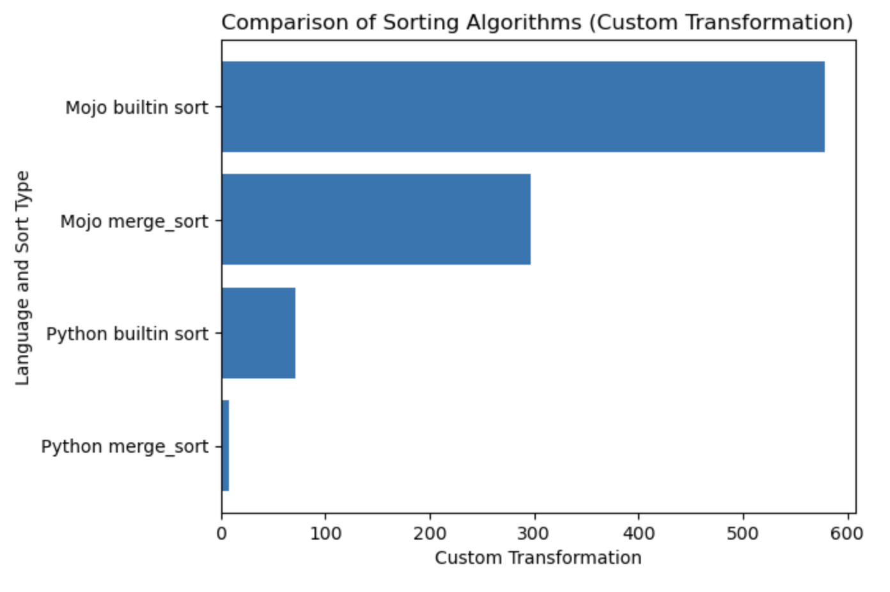

# [Fibonacci sequence](https://en.wikipedia.org/wiki/Fibonacci_sequence)

## [Python Fib](algorithm/Fib_Python.py)

```python
#%%python
from time import time


def fib(n):
    return n if n < 2 else fib(n - 1) + fib(n - 2)


def run_python_benchmark():
    t0 = time()
    ans = fib(40)
    t1 = time()
    print(f'Computed fib(40) = {ans} in {t1 - t0} seconds.')


run_python_benchmark()
# Computed fib(40) = 102334155 in 21.669286727905273 seconds.


def fib_range(n):
    a, b = 0, 1
    for _ in range(n):
        a, b = b, a+b
    return a


def run_python_fib_range_benchmark():
    t0 = time()
    ans = fib_range(40)
    t1 = time()
    print(f'Computed fib_range(40) = {ans} in {t1 - t0} seconds.')


run_python_fib_range_benchmark()
# Computed fib_range(40) = 102334155 in 4.5299530029296875e-06 seconds.
```

## [Mojo🔥 Fib with def](algorithm/FibDef_Mojo.mojo)

```python
from Time import now


def fibm(n):
    return n if n < 2 else fibm(n - 1) + fibm(n - 2)


def run_mojo_benchmark():
    let t0 = now()
    let ans = fibm(40)
    let t1 = now()

    ans.print()
    print("\n")
    print("Computed fibm(40)", F64(t1 - t0) / 1e9, "seconds")


run_mojo_benchmark()
# 102334155
# Computed fibm(40) 4.2934318319999996 seconds
```

## [Mojo🔥 Fib with fn](algorithm/FibFn_Mojo.mojo)

```python
from Time import now


fn fibf(n: Int) -> Int:
return n if n < 2 else fibf(n - 1) + fibf(n - 2)


def run_mojo_fn_benchmark():
    let t0 = now()
    let ans = fibf(40)
    let t1 = now()
    print("Computed fibf(40)", ans, F64(t1 - t0) / 1e9, "seconds")


run_mojo_fn_benchmark()
# Computed fibf(40) 102334155 0.41657813999999999 seconds


fn fibf_range(n: Int) -> Int:
    var a: Int = 0
    var b: Int = 1
    for _ in range(n):
        a = b
        b = a+b
    return a


def run_mojo_fibf_range_benchmark():
    let t0 = now()
    let ans = fibf_range(40)
    let t1 = now()
    print("Computed fibf_range(40)", ans, F64(t1 - t0) / 1e9, "seconds")


run_mojo_fibf_range_benchmark()
# Computed fibf_range(40) 549755813 3.7e-08 seconds
```

## [Codon Fib](algorithm/Fib_Codon.py)

```python
from time import time

def fib(n):
    return n if n < 2 else fib(n - 1) + fib(n - 2)


t0 = time()
ans = fib(40)
t1 = time()
print(f'Computed fib(40) = {ans} in {t1 - t0} seconds.')
# Computed fib(40) = 102334155 in 0.275645 seconds.
```

## Summary for Fibonacci sequence algorithms

| Lang                  | sec             |
|-----------------------|-----------------|
| Python recursion      | 21.66928672     |
| Python range          | **0.000004529** |
| Mojo🔥 def recursion  | 4.293431831     |
| Mojo🔥 fn recursion   | 0.416578139     |
| **Mojo🔥 fn range**   | **0.000000037** |
| Codon recursion       | 0.275645 [1]    |

* Mojo🔥boost in **122 times**.
* Mojo🔥 `fn` definitely better optimize than `def` [read more here](https://docs.modular.com/mojo/notebooks/HelloMojo.html#fn-definitions)
* Python lack of [tail recursion optimization](https://stackoverflow.com/questions/13591970/does-python-optimize-tail-recursion)
* [Welcome to Codon](https://docs.exaloop.io/codon), [1] we can not measure it in Modular playground.

Files:

* [fib.codon](algorithm/fib.codon)
* [fib.codon.exe.md](algorithm/fib.codon.exe.md)
* [fib.cpython-311.pyc.md](algorithm/fib.cpython-311.pyc.md)


# Programming manual

## Parameterization[]: compile time meta-programming

I strongly recommended start from here [HelloMojo](https://docs.modular.com/mojo/notebooks/HelloMojo.html)
and understand **[parameter]** and **[parameter expressions]** [parameterization here](https://docs.modular.com/mojo/notebooks/HelloMojo.html#parameterization-compile-time-meta-programming).
Like in this example:

```python
fn concat[len1: Int, len2: Int](lhs: MySIMD[len1], rhs: MySIMD[len2]) -> MySIMD[len1+len2]:
    let result = MySIMD[len1 + len2]()
    for i in range(len1):
        result[i] = lhs[i]
    for j in range(len2):
        result[len1 + j] = rhs[j]
    return result


let a = MySIMD[2](1, 2)
let x = concat[2,2](a, a)
x.dump()
```

Compile time **[Parameters]:** `fn concat[len1: Int, len2: Int]`.

Run time **(Args)**: `fn concat(lhs: MySIMD, rhs: MySIMD)`.

Parameters [PEP695](https://peps.python.org/pep-0695/) syntax in square `[]` brackets.

Now in Python:

```python
def func(a: _T, b: _T) -> _T:
    ...
```

Now in Mojo🔥:

```python
def func[T](a: T, b: T) -> T:
    ...
```

**[Parameters]** are named and have types **like normal values** in a Mojo program, but `parameters[]` are evaluated at **compile time**.

The runtime program may use the value of **[parameters]** - because the parameters are resolved at compile time
before they are needed by the runtime program - but the compile time parameter expressions may not use runtime values.

`Self` type from [PEP673](https://peps.python.org/pep-0673/)

```python
fn __sub__(self, rhs: Self) -> Self:
    let result = MySIMD[size]()
    for i in range(size):
        result[i] = self[i] - rhs[i]
    return result
```

In the docs you can find word **Fields** it is aka class **Attributes** in the Python.

So, you call them with `dot`.

```python
from DType import DType
let bool_type = DType.bool
```

## Data Type Model and alias

* The base construct block is [DType](https://docs.modular.com/mojo/MojoStdlib/DType.html).
  Some analogies:
  - [NumPy dtype](https://numpy.org/doc/stable/reference/generated/numpy.dtype.html#numpy-dtype)
  - [Jax dtype](https://jax.readthedocs.io/en/latest/_autosummary/jax.numpy.dtype.html#jax-numpy-dtype)
  - [TensorFlow DType](https://www.tensorflow.org/api_docs/python/tf/dtypes/DType)

```python
from DType import DType
DType.si8
```

* Then you can wrap it with **SIMD struct** aka container.
* SIMD [Single Instruction, Multiple Data](https://docs.modular.com/mojo/MojoStdlib/SIMD.html) and [SIMD at wikipedia](https://en.wikipedia.org/wiki/Single_instruction,_multiple_data)

```python
from DType import DType
from SIMD import SIMD, SI8

alias MY_SIMD_DType_si8 = SIMD[DType.si8, 1]
alias MY_SI8 = SI8
print(MY_SIMD_DType_si8 == MY_SI8)
# true
```

* Then a sequence of these types you can wrap with a container [DynamicVector](https://docs.modular.com/mojo/MojoStdlib/Vector.html) or similar.

```python
from DType import DType
from SIMD import SIMD, SI8
from Vector import DynamicVector
from String import String

alias a = DynamicVector[SIMD[DType.si8, 1]]
alias b = DynamicVector[SI8]
print(a == b)
print(a == String)
print(b == String)
# all true
```

So the `String` is only alias for a something like `DynamicVector[SIMD[DType.si8, 1]]`.

## `VariadicList` for destructuring/unpacking/accessing arguments

```python
from List import VariadicList

fn destructuring_arguments(*args: Int):
    let my_var_list = VariadicList(args)
    for i in range(len(my_var_list)):
        print("argument", i, ":", my_var_list[i])

destructuring_arguments(1, 2, 3, 4)
```

It is very useful for creating initial collections.
We can write like this:

```python
from Vector import DynamicVector
from StaticTuple import StaticTuple

fn create_vertor() -> DynamicVector[Int]:
    let st = StaticTuple[4, Int](1, 2, 3, 4)
    var v = DynamicVector[Int](st.__len__())
    for i in range(st.__len__()):
    v.push_back(st[i])
    return v

v = create_vertor()
print(v[0], v[3])

# or
from List import VariadicList

fn create_vertor() -> DynamicVector[Int]:
  let var_list = VariadicList(1, 2, 3, 4)
  var v = DynamicVector[Int](len(var_list))
  for i in range(len(var_list)):
    v.push_back(var_list[i])
  return v

v = create_vertor()
print(v[0], v[3])
```

Read more about function [def](https://docs.modular.com/mojo/notebooks/HelloMojo.html#fn-definitions) and [fn](https://docs.modular.com/mojo/programming-manual.html#fn-definitions)

## String

```python
from String import String
# String concatenation
print(String("'") + String(1) + "'\n")

# Python's join
print(String("|").join("a", "b", "c"))

# String format
from IO import _printf as print
let x: Int = 1
print("'%i'\n", x.value)
```

### String and builtin slice

For a string you can use [Builtin Slice](https://docs.modular.com/mojo/MojoBuiltin/BuiltinSlice.html) with format string slice[start:end:step].

```python
from String import String

let hello_mojo = String("Hello Mojo!")
print("Till the end:", hello_mojo[0::])
print("Before last 2 chars:", hello_mojo[0:-2])
print("From start to the end with step 2:", hello_mojo[0::2])
print("From start to the before last with step 3:", hello_mojo[0:-1:3])
```

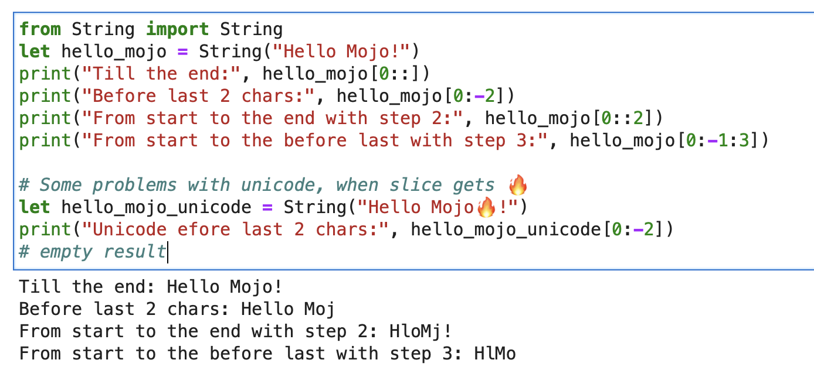

There is some problem with unicode, when slicing 🔥:

```python
let hello_mojo_unicode = String("Hello Mojo🔥!")
print("Unicode efore last 2 chars:", hello_mojo_unicode[0:-2])
# no result, silents
```

Here is an [explanation](https://mzaks.medium.com/counting-chars-with-simd-in-mojo-140ee730bd4d) and some [discussion](https://github.com/modularml/mojo/discussions/270).

[mbstowcs - convert a multibyte string to a wide-character string](https://man7.org/linux/man-pages/man3/mbstowcs.3.html)

## Mojo🔥decorators

### @value
`struct` decorator aka Python `@dataclass`.
It will generate methods `__init__`, `__copyinit__`, `__moveinit__` for you automatically.

```python
@value
struct dataclass:
    var name: String
    var age: Int
```
Note that the `@value` decorator only works on types whose members are `copyable` and/or `movable`.

### @value("trivial")

### @register_passable("trivial")
Trivial types. This decorator tells Mojo that the type should be copyable `__copyinit__` and movable `__moveinit__`.
It also tells Mojo to prefer to pass the value in CPU registers.
Allows `structs` to opt-in to being passed in a `register` instead of passing through `memory`.

```python
@register_passable("trivial")
struct Int:
    var value: __mlir_type.`!pop.scalar<index>`
```

### @always_inline
Decorators that provide full **control** over **compiler optimizations**.
Instructs compiler to always **inline** this function when it’s called.

```python
@always_inline
fn foo(x: Int, y: Int) -> Int:
    return x + y

fn bar(z: Int):
    let r = foo(z, z) # This call will be inlined
```

### @parameter
It can be placed on nested functions that capture runtime values to create “parametric” capturing closures.
It allows closures that capture runtime values to be passed as parameter values.

### Decorators combination
```python
@always_inline
@parameter
fn test(): return
```

## Casting

Some casting examples

```python
s: StringLiteral
let p = DTypePointer[DType.si8](s.data()).bitcast[DType.ui8]()
var result = 0
result += ((p.simd_load[64](offset) >> 6) != 0b10).cast[DType.ui8]().reduce_add().to_int()
let rest_p: DTypePointer[DType.ui8] = stack_allocation[simd_width, UI8, 1]()

from Bit import ctlz
s: String
i: Int
let code = s.buffer.data.load(i)
let byte_length_code = ctlz(~code).to_int()
```

## Stack, Mem, Pointer, Allocation, Free

## DTypePointer, Heap and Stack

**DTypePointer** - store an address with a given DType, allowing you to allocate, load and modify data with convenient access to SIMD operations.

```python
from Pointer import DTypePointer
from DType import DType
from Random import rand
from Memory import memset_zero

# `heap`
var my_pointer_on_heap = DTypePointer[DType.ui8].alloc(8)
memset_zero(my_pointer_on_heap, 8)

# `stack or register`
var data = my_pointer_on_heap.simd_load[8](0)
print(data)

rand(my_pointer_on_heap, 4)

# `data` does not contain a reference to the `heap`, so load the data again
data = my_pointer_on_heap.simd_load[8](0)
print(data)

# simd_load and simd_store
var half = my_pointer_on_heap.simd_load[4](0)
half = half + 1
my_pointer_on_heap.simd_store[4](4, half)
print(my_pointer_on_heap.simd_load[8](0))

# Pointer move back
my_pointer_on_heap -= 1
print(my_pointer_on_heap.simd_load[8](0))

# Mast free memory
my_pointer_on_heap.free()
```

Struct can minimaze potential dangerous of pointers by limiting scoup.

Excellent article on Mojo Dojo blog about [DTypePointer here](https://mojodojo.dev/guides/modules/Pointer/DTypePointer.html#storing-and-loading-simd-data)

Plus his example [Matrix Struct and DTypePointer](algorithm/MatrixStruct.mojo)

## Pointer

[Pointer](https://docs.modular.com/mojo/MojoStdlib/Pointer.html) store an address to any `register_passable type`, and allocate `n` amount of them to the `heap`.

```python
from Pointer import Pointer
from Memory import memset_zero
from String import String

@register_passable  # for syntaxt like `let coord = p1[0]` and let it be passed through registers.
struct Coord:  # memory-only type
    var x: UI8
    var y: UI8

var p1 = Pointer[Coord].alloc(2)

memset_zero(p1, 2)
var coord = p1[0]  # is an identifier to memory on the stack or in a register
print(coord.x)

# Store the value

coord.x = 5
coord.y = 5
print(coord.x)

# We need to store the data.
p1.store(0, coord)
print(p1[0].x)

# Mast free memory
p1.free()
```

Full article about [Pointer](https://mojodojo.dev/guides/modules/Pointer/Pointer.html)

Plus exemple [Pointer and Struct](algorithm/Pointer.mojo)

## Advanced Mojo🔥features and Intrinsics module
Modular [Intrinsics](https://docs.modular.com/mojo/MojoStdlib/Intrinsics.html) it is some kind of **execution backends**:

- Mojo🔥**compiler** features
- **LLVM intrinsic** maybe [this one](https://libc.llvm.org/stdio.html)
- **External call** like [libc](https://www.gnu.org/software/libc/manual/html_node/Function-Index.html)
- [MLIR Multi-Level Intermediate Representation](https://docs.modular.com/mojo/notebooks/BoolMLIR.html)

Mojo🔥-> [MLIR Dialects](https://mlir.llvm.org/docs/Dialects/) -> execution backends with optimization code and architectures.

[MLIR](https://mlir.llvm.org/docs) is a compiler infrastructure witch implementing various transformation and optimization passes for different **programming languages** and **architectures**.

### Syscalls
MLIR itself does not directly provide functionality for interacting with operating system [syscalls](https://en.wikipedia.org/wiki/System_call).

Which are low-level interfaces to operating system services, are typically handled at the level of the target programming language or the operating system itself.
MLIR is designed to be language-and-target-agnostic, and its primary focus is on providing an intermediate representation for performing optimizations.
To perform operating system syscalls in MLIR, we need to use a target-specific **backend**.

But with these `execution backends`, basically, we have access to OS syscalls.
And we have the whole world of C/LLVM/Python stuff under the hood.

Lets have same quick look on it in practice:

```python
from OS import getenv

print(getenv("PATH"))
print(getenv(StringRef("PATH")))

# or like this
from SIMD import SI8
from Intrinsics import external_call

var path1 = external_call["getenv", StringRef](StringRef("PATH"))
print(path1.data)

var path2 = external_call["getenv", StringRef]("PATH")
print(path2.data)

let abs_10 = external_call["abs", SI8, Int](-10)
print(abs_10)
```

In this simple example we used `external_call` to get OS environment variable with a casting type between Mojo and libc functions.
Pretty cool, yeah!

I have a lot of ideas from this topic and I am eagerly awaiting the opportunity to implement them soon.
Taking action can lead to amazing outcomes =)

## MLIR libc gethostname

Let's do something interesting - call `libc function` [gethostname](https://www.gnu.org/software/libc/manual/html_node/Host-Identification.html#index-gethostname).

Function has this interface `int gethostname (char *name, size_t size)`.

For that we can use helper function [external_call](https://docs.modular.com/mojo/MojoStdlib/Intrinsics.html#external_call) from **Intrinsics** module or write own [MLIR](https://docs.modular.com/mojo/notebooks/HelloMojo.html#direct-access-to-mlir).

Let's go code:

```python
from Intrinsics import external_call
from SIMD import SIMD, SI8
from DType import DType
from Vector import DynamicVector
from DType import DType
from Pointer import DTypePointer, Pointer

# We can use `from String import String` but for clarification we will use a full form.
# DynamicVector[SIMD[DType.si8, 1]] == DynamicVector[SI8] == String

# Compile time stuff.
alias cArrayOfStrings = DynamicVector[SIMD[DType.si8, 1]]
alias capacity = 1024

var c_pointer_to_array_of_strings = DTypePointer[DType.si8](cArrayOfStrings(capacity).data)
var c_int_result = external_call["gethostname", Int, DTypePointer[DType.si8], Int](c_pointer_to_array_of_strings, capacity)
let mojo_string_result = String(c_pointer_to_array_of_strings.address)

print("C function gethostname result code:", c_int_result)
print("C function gethostname result value:", star_hostname(mojo_string_result))


@always_inline
fn star_hostname(hostname: String) -> String:
    # [Builtin Slice](https://docs.modular.com/mojo/MojoBuiltin/BuiltinSlice.html)
    # string slice[start:end:step]
    return hostname[0:-1:2]
```

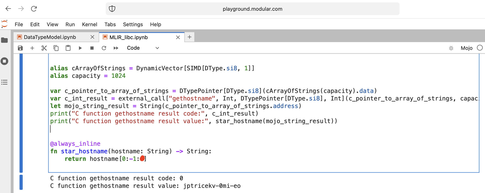


## Mojo🔥TCP Socket Server with PythonInterface

Let's do some things for a WEB with Mojo🔥.
We do not have Internet access at playground.modular.com
But we can steal do some interesting stuff like TCP on one machine.

Let's write the first TCP client-server code in Mojo🔥 with [PythonInterface](https://docs.modular.com/mojo/MojoPython/PythonInterface.html)

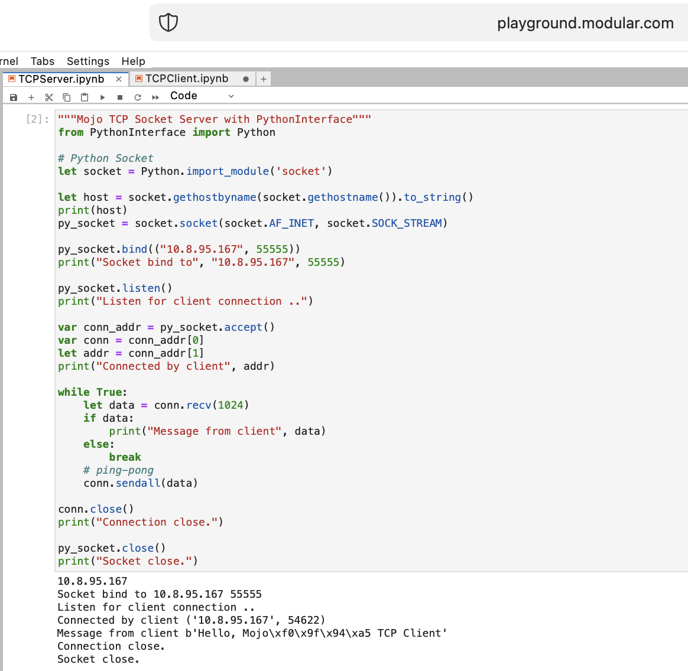
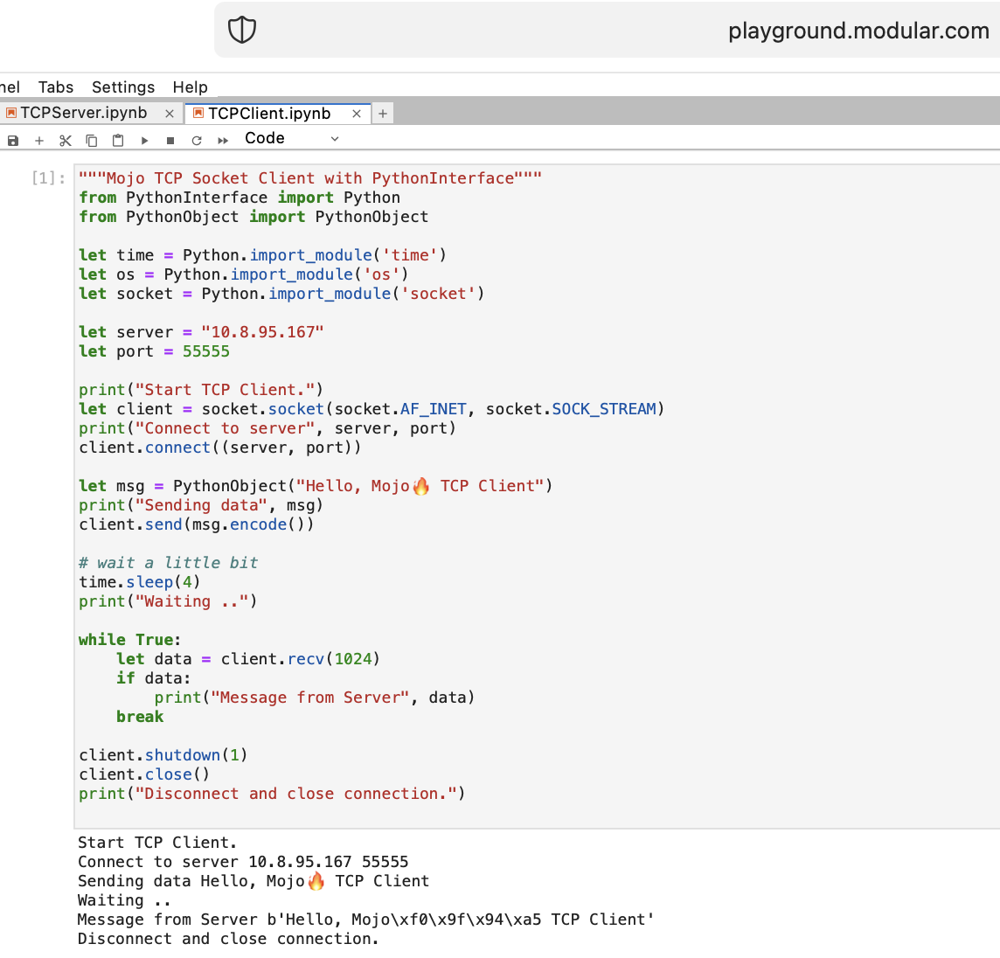

* [Mojo TCP Socket Server](algorithm/TCPSocketServer.mojo)
* [Mojo TCP Client Server](algorithm/TCPSocketClient.mojo)

You should create two separate notebooks, and run **TCPSocketServer** first then **TCPSocketClient**.

**Python version** of this code almost the same, except:

- `with` syntax
- `let` assigning
- and destructuring like `a, b = (1, 2)`

* [Pytohn socket low-level networking interface](https://docs.python.org/3/library/socket.html)
* [Pytohn socketserver framework for network servers](https://docs.python.org/3/library/socketserver.html#module-socketserver)


## Mojo🔥FastAPI with PythonInterface

After TCP Server in Mojo🔥 we are going forward =)

It's crazy, but let's try to run modern Python web server [FastAPI](https://fastapi.tiangolo.com) with Mojo🔥!

### Preparation
We need to upload FastAPI code to playground.
So, on your local machine do

```shell
pip install --target=web fastapi uvicorn
tar -czPf web.tar.gz web
```
and upload `web.tar.gz` to playground via web interface.

Then we need to `install` it, just put into proper folder:

```python
%%python
import os
import site

site_packages_path = site.getsitepackages()[0]
# install fastapi
os.system(f"tar xzf web.tar.gz -C {site_packages_path}")
os.system(f"cp -r {site_packages_path}/web/* {site_packages_path}/")
os.system(f"ls {site_packages_path} | grep fastapi")
# clean packages
os.system(f"rm -rf {site_packages_path}/web")
os.system(f"rm web.tar.gz")
```

### Mojo🔥FastAPI Server

```python
from PythonInterface import Python

# Python fastapi
let fastapi = Python.import_module("fastapi")
let uvicorn = Python.import_module("uvicorn")

var app = fastapi.FastAPI()
var router = fastapi.APIRouter()

# tricky part
let py = Python()
let py_code = """lambda: 'Hello Mojo🔥!'"""
let py_obj = py.evaluate(py_code)
print(py_obj)

router.add_api_route("/mojo", py_obj)
app.include_router(router)

print("Start FastAPI WEB Server")
uvicorn.run(app)
print("Done")
```

### Mojo🔥FastAPI Client

```python
from PythonInterface import Python
let http_client = Python.import_module("http.client")

let conn = http_client.HTTPConnection("localhost", 8000)
conn.request("GET", "/mojo")
let response = conn.getresponse()
print(response.status, response.reason, response.read())
```

As usual, you should create two separate notebooks, and run **FastAPI** first then **FastAPIClient**.

* [Mojo🔥FastAPI Server](algorithm/MojoFastAPI.mojo)
* [Mojo🔥FastAPI Server Jupyter Notebook](notebooks/MojoFastAPI.ipynb)
* [Mojo🔥FastAPI Client](algorithm/MojoFastAPIClient.mojo)
* [Mojo🔥FastAPI Client Jupyter Notebook](notebooks/MojoFastAPIClient.ipynb)

There are a lot of open questions, but basically we achieve the goal.

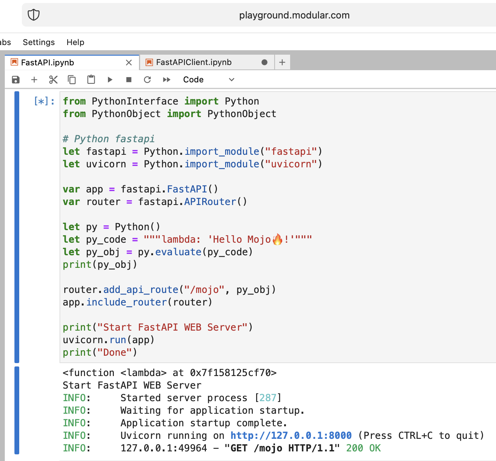
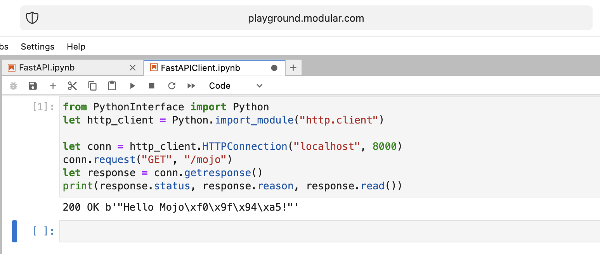

Mojo🔥 well done!

Some open questions:

- Lack of Python syntax sugar
- Lack of Mojo types implicitly converted into Python objects
- How to pass Mojo function into Python space/function

```python
from PythonInterface import Python

let pyfn = Python.evaluate("lambda x, y: x+y")
let functools = Python.import_module("functools")
print(functools.reduce(pyfn, [1, 2, 3, 4]))

# How to, without Mojo pyfn.so?
def pyfn(x, y):
    retyrn x+y
```

The future looks very optimistic!

Links:

* [Mojo types in Python](https://docs.modular.com/mojo/programming-manual.html#mojo-types-in-python)
* [Mandelbrot in Mojo with Python plots](https://docs.modular.com/mojo/notebooks/Mandelbrot.html)


# Code implementation

## Radiative transfer
[Benchmark Mojo vs Numba by Nick Wogan](https://gist.github.com/Nicholaswogan/ca156adb065cb598bd3903b3eaab2381)

## Instant and DateTimeLocal
[Time utils by Samay Kapadia @Zalando](https://github.com/modularml/mojo/issues/156)

## IDEA
[Connecting to your mojo playground from VSCode or DataSpell](https://github.com/modularml/mojo/discussions/277)

## Python Interface and reading files
by Maxim Zaks

```python
from String import String
from PythonInterface import Python

let pathlib = Python.import_module('pathlib')
let txt = pathlib.Path('nfl.csv').read_text()
let s: String = txt.to_string()
```


[libc implementation](https://github.com/crisadamo/mojo-libc/blob/main/Libc.mojo)


## Code share from Mojo Playground

1. From the Mojo Playground, `right click` the file in the explorer and press `Open With > Editor`
2. Right click in the editor, `select all` and `copy`
3. Create a new [GitHub gist](https://gist.github.com) or put Jupyter notebook file into yor GitHub repository
4. Paste in the contents and name the file with the Jupyter extension like test`.ipynb`
5. Paste the link to the gist in the Discord chat

Github renders it properly, and then if someone wants to try out the code in their playground they can copy paste the raw code.


# The Zen of Mojo🔥

* [Style Guide for Mojo Code. Zen of Mojo #141](https://github.com/modularml/mojo/discussions/141)

# Space for improvements

It is my personal view, so don't judge me too harshly.

I can't say that Mojo🔥 is an easy programming language for learning, like a Python as an example.

It requires a lot of understanding, patience and experience in any other programming languages.

If you want to build something not trivial, it will be hard but funny!

It has been **2 weeks** since I embarked on this **journey**, and I am thrilled to share that I have now become **well-acquainted** with the Mojo🔥.

The intricacies of its **structure and syntax** have started to **unravel before my eyes**, and I am filled with a newfound **understanding**.

I am proud to say that I can now confidently **craft code** in this language, allowing me to bring to life a **diverse** range of **ideas**.

## Major things to improve:

1. Weak and unclear **documentation**.
2. Lack of **code examples**.
   A good example is [clojuredocs](https://clojuredocs.org) website.
3. More **explanation** to the language **paradigms**
4. Lack **comparison** to Python base things datatypes/functions/classes/expressions.
5. Even though Mojo is superset of Python, the **threshold** of language entry is **not so simple**.
6. A little bit raw, need some time for **stabilizing** language. Production release 1.0.
7. **Bugs**, like in any one.
8. Small **standard library**.
9. Project Jupyter and **notebooks environment**.
   I understand that Jupyter plugin and custom kernel are a good solution, but it is makes development so slow.
10. Not **open-sourced** yet.
   The community is waiting for open source compiler and REPL to start developing and producing libraries and applications.
   I think the community will easily rewrite the (bootstrapping) compiler from C++ to itself Mojo🔥.

## Good and nice for win

1. **Modular team** easily responds to requests/questions/letters/ideas
2. **Friendly** and very smart **community**
3. **Problem-solving** programming language with an idea to not create new syntax but deal with real word challenges.
4. I don't know about you, but I was waiting and researching a long time for a Mojo🔥.
   I have been tried a hundred of programming languages.
   The World is ready for the revolution and the future of computation and AI.
   I'm really into Mojo🔥, it excites, fascinates me, and I hope it does the same for you.
5. I believe that a well-known distinguished leader Ph.D. Computer Science Chris Lattner can build things, systems, teams and change the future.

## Modular and Mojo🔥 history and etymology

Mojo🔥 is a [Modular Inc](https://www.modular.com) programming language. Why **Mojo** we [discussed here](https://github.com/ego/awesome-mojo#why-is-it-called-mojo).
About [Company](https://www.modular.com/about) we know less, but it has a very cool name `Modular`,
which can be referred to:

* [Modular arithmetic](https://en.wikipedia.org/wiki/Modular_arithmetic)
* [Modulo](https://en.wikipedia.org/wiki/Modulo)
* [Modular programming](https://en.wikipedia.org/wiki/Modular_programming)
* [Modularity](https://en.wikipedia.org/wiki/Modularity)

> ["In other words: Mojo isn’t magic, it’s modular."](https://docs.modular.com/mojo/notebooks/BoolMLIR.html)

All about computing, programming, AI/ML.
A very good domain name that accurately describes the meaning of the Company.

There are some additional materials about [Modular's Brand Story](https://www.modular.com/blog/modulars-brand-story)
and [Helping Modular Humanize AI Through Brand](https://www.metalab.com/blog/helping-modular-humanize-ai-through-brand)

# Additional materials

* [Chris Lattner](https://nondot.org/sabre/)
* [LLVM](https://llvm.org)
* [MLIR](https://mlir.llvm.org)
* [Circuit IR Compilers and Tools](https://circt.llvm.org)
* [Cross Compile Compiler-rt](https://releases.llvm.org/8.0.1/docs/HowToCrossCompileBuiltinsOnArm.html)
* [The future of AI depends on Modularity](https://www.modular.com/blog/the-future-of-ai-depends-on-modularity)
* [The Architecture of Open Source Applications LLVM](https://aosabook.org/en/v1/llvm.html)
* [The Golden Age of Compiler Design in an Era of HW/SW Co-design by Dr. Chris Lattner](https://youtu.be/4HgShra-KnY)
* [LLVM in 100 Seconds](https://youtu.be/BT2Cv-Tjq7Q)
* [Mojo Dojo](https://mojodojo.dev/mojo_team_answers.html)
* [Mojo Cheatsheet](https://github.com/czheo/mojo-cheatsheet/tree/main)
* [Counting chars with SIMD in Mojo](https://mzaks.medium.com/counting-chars-with-simd-in-mojo-140ee730bd4d)
* [History of programming languages](https://en.wikipedia.org/wiki/History_of_programming_languages)

## MLIR and low-level implementation

* [Doxygen mlir](https://mlir.llvm.org/doxygen/index.html)
* [IndexOps](https://mlir.llvm.org/docs/Dialects/IndexOps/)
* [LLVM libc](https://libc.llvm.org/)
* [GNU libc](https://www.gnu.org/software/libc/manual/html_mono/libc.html)
* [GNU libc Index](https://www.gnu.org/software/libc/manual/html_node/Function-Index.html)

## Python / C++

* [Numpy](https://numpy.org/doc/stable/user/whatisnumpy.html)
* [Numba](https://numba.pydata.org/numba-doc/latest/user/5minguide.html) based on (LLVM)
* [PyPy](https://www.pypy.org/)
* [Google JAX](https://github.com/google/jax) based on (XLA)
  * [Autograd](https://github.com/hips/autograd)
  * [XLA](https://www.tensorflow.org/xla)
* [Ray](https://github.com/ray-project/ray)
* [Taichi Lang](https://github.com/taichi-dev/taichi)
  * [Taichi compared to cub cupy numba](https://docs.taichi-lang.org/blog/taichi-compared-to-cub-cupy-numba)
* [Codon](https://github.com/exaloop/codon)
  * [Codon benchmarks](https://exaloop.io/benchmarks)
* [CuPy](https://github.com/cupy/cupy)
* [Cython](https://github.com/cython/cython)
* [Pythran](https://github.com/serge-sans-paille/pythran)
* [Mypyc](https://mypyc.readthedocs.io/en/latest/introduction.html)
* [Nuitka](https://github.com/Nuitka/Nuitka)
* [DeepSpeed](https://github.com/microsoft/DeepSpeed)
* [Benchmarks for CPU and GPU performance high-performance Python libs](https://github.com/dionhaefner/pyhpc-benchmarks)
* [Metaflow](https://metaflow.org)
* [Accelerating experimentation with mlops](https://www.rea-group.com/about-us/news-and-insights/blog/accelerating-experimentation-with-mlops/)
* [nebuly-ai](https://github.com/nebuly-ai/nebuly/tree/v0.9.0)
* [Numba compiler for Python bytecode, Numba IR into LLVM IR, Compile LLVM IR to machine code](https://numba.readthedocs.io/en/stable/developer/architecture.html)

## AI

* [Accelerated Computing](https://blogs.nvidia.com/blog/2021/09/01/what-is-accelerated-computing/)
* [ONNX open standard for machine learning](https://github.com/onnx/onnx)
* [ONNX Runtime: cross-platform, high performance ML inferencing and training accelerator](https://github.com/microsoft/onnxruntime)
* [CUDA](https://docs.nvidia.com/cuda/cuda-toolkit-release-notes/index.html)
* [OpenCL](https://www.khronos.org/opencl/)
* [SYCL](https://www.khronos.org/api/index_2017/sycl)
* [Google Brain TensorFlow](https://github.com/tensorflow/tensorflow)
* [PyTorch](https://github.com/pytorch/pytorch)
* [TensorRT](https://github.com/NVIDIA/TensorRT)
* [OpenaAI Triton language and compiler](https://github.com/openai/triton)
* [Made With ML](https://madewithml.com)
* [Vertex AI](https://cloud.google.com/vertex-ai)
* [Google TPU](https://cloud.google.com/tpu)
* [Sagemaker](https://aws.amazon.com/sagemaker/)
* [MLIR: accelerating AI with open-source infrastructure](https://www.blog.google/technology/ai/mlir-accelerating-ai-open-source-infrastructure/)
* [Apache TVM](https://tvm.apache.org)


# Contributing

* Your contributions are always welcome!
* If you have any **question**, do not hesitate to contact me.
* If you would like to participate in the initiative [Mojo🔥Driven Community](https://mojo-lang.dev), please contact me.
